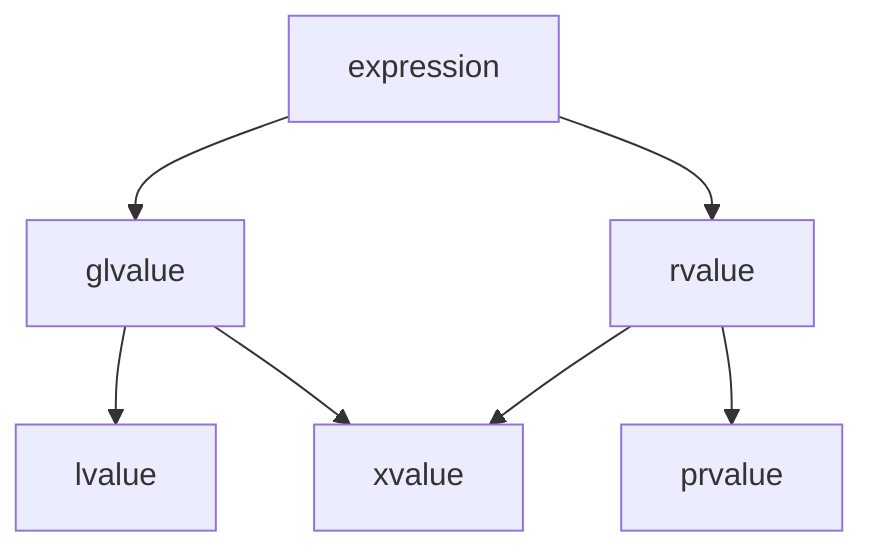

# 值类别

值类别是 C++11 标准中新引入的概念，具体来说他是表达式的一种属性，该属性将表达式分为3个类别，它们分别是左值（lvalue）、纯右值（rvalue）和将亡值（xvalue）。

表达式首先被分为泛左值（glvalue）和右值（rvalue），其中泛左值被进一步分为左值与将亡值，右值又被划分为将亡值与纯右值。

1. 所谓的泛左值是指用过评估能够确定的对象、位域或函数的标识的表达式。简单来说，它确定了对象或者函数的标识（具名对象）。
2. 而纯右值是指一个通过评估能够用于初始化对象和位域，或者能够计算运算符操作数的值的表达式。
3. 将亡值属于泛左值的一种，它表示资源可以被重用的对象和位域，通常这是因为它们接近其生命周期的末尾，另外也可能是经过右值引用的特性转换的。

将亡值的产生

1. 使用类型转换将泛左值转换为该类型的右值引用。
2. 在 C++17 标准中引入，称为临时量实质化，指的是纯右值转换到临时对象的过程。每当纯右值出现在一个需要泛左值的地方时，临时量实质化都会发生，也就是说都会创建一个临时对象并且使用纯右值对其进行初始化，这也符合纯右值的概念，而这里的临时对象就是一个将亡值。

> 注意：
>
> 在 C++17 之前临时变量是纯右值，只有转化为右值引用的类型才是将亡值。